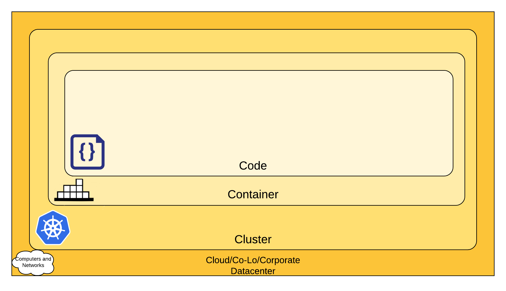

This chapter gathers the official security recommendations provided by the Kubernetes. They provide a list of concerns for each level of cloud infrastructure.

## Cloud infrastructure layers
Cloud infrastructure can be viewed as a composition of four layers.

{width=100%}

Each layer is built upon the previous one and its security depends on the security of the outer layers.
It is, therefore, important to maintain high security standarts on base levels (Cloud, Cluster, Container).

### Cloud
Each cloud provider has its own security policies and guidelines. There are, however, some general infrastructure-level security best advice:

| **Area of Concern for Kubernetes Infrastructure** | **Recommendation**                                                                                                                                                                                                                                                                                           |   |   |   |
|---------------------------------------------------|--------------------------------------------------------------------------------------------------------------------------------------------------------------------------------------------------------------------------------------------------------------------------------------------------------------|---|---|---|
| Network access to API Server (Control plane)      | All access to the Kubernetes control plane is not allowed publicly on the internet and is controlled by network access control lists restricted to the set of IP addresses needed to administer the cluster.                                                                                                 |   |   |   |
| Network access to Nodes (nodes)                   | Nodes should be configured to only accept connections (via network access control lists) from the control plane on the specified ports, and accept connections for services in Kubernetes of type NodePort and LoadBalancer. If possible, these nodes should not be exposed on the public internet entirely. |   |   |   |
| Kubernetes access to Cloud Provider API           | Each cloud provider needs to grant a different set of permissions to the Kubernetes control plane and nodes. It is best to provide the cluster with cloud provider access that follows the principle of least privilege for the resources it needs to administer.                                            |   |   |   |
| Access to etcd                                    | Access to etcd (the datastore of Kubernetes) should be limited to the control plane only. Depending on your configuration, you should attempt to use etcd over TLS.                                                                                                                                          |   |   |   |
| etcd Encryption                                   | Wherever possible it's a good practice to encrypt all storage at rest, and since etcd holds the state of the entire cluster (including Secrets) its disk should especially be encrypted at rest.                                                                                                             |   |   |   |

### Cluster
There are two cluster security concerns that could be addressed: securing the configurable cluster components and securing the applications running in the cluster. Security of cluster components is described in **Cluster security** chapter.

There are a few things to consider regarding the application security:

* RBAC Authorization (Access to the Kubernetes API)
* Authentication	
* Application secrets management (and encrypting them in etcd at rest)
* Ensuring that pods meet defined Pod Security Standards
* Quality of Service (and Cluster resource management)
* Network Policies
* TLS for Kubernetes Ingress

### Container
Securing containers is a vast topic, which deserves its own chapter. There are, nevertheless, a few general recommendation provided by the Kubernetes: 

| **Area of Concern for Containers**                          | **Recommendation**                                                                                                                                                                     |
|-------------------------------------------------------------|----------------------------------------------------------------------------------------------------------------------------------------------------------------------------------------|
| Container Vulnerability Scanning and OS Dependency Security | As part of an image build step, you should scan your containers for known vulnerabilities.                                                                                             |
| Image Signing and Enforcement                               | Sign container images to maintain a system of trust for the content of your containers.                                                                                                |
| Disallow privileged users                                   | When constructing containers, create users inside of the containers that have the least level of operating system privilege necessary in order to carry out the goal of the container. |

### Code
When it comes to code, the developers have the most flexibility to design secure applications. There are a lot of issues to address, which may vary significantly from application to application depending on its purpose, architecture and framework base. Kubernetes documentation gives a handful of recommendations regarding this topic.

| **Area of Concern for Code**          | **Recommendation**                                                                                                                                                                                                                                                                                                                                                                                                                        |
|---------------------------------------|-------------------------------------------------------------------------------------------------------------------------------------------------------------------------------------------------------------------------------------------------------------------------------------------------------------------------------------------------------------------------------------------------------------------------------------------|
| Access over TLS only                  | If your code needs to communicate by TCP, perform a TLS handshake with the client ahead of time. With the exception of a few cases, encrypt everything in transit. Going one step further, it's a good idea to encrypt network traffic between services. This can be done through a process known as mutual TLS authentication or mTLS which performs a two sided verification of communication between two certificate holding services. |
| Limiting port ranges of communication | This recommendation may be a bit self-explanatory, but wherever possible you should only expose the ports on your service that are absolutely essential for communication or metric gathering.                                                                                                                                                                                                                                            |
| 3rd Party Dependency Security         | It is a good practice to regularly scan your application's third party libraries for known security vulnerabilities. Each programming language has a tool for performing this check automatically.                                                                                                                                                                                                                                        |
| Static Code Analysis                  | Most languages provide a way for a snippet of code to be analyzed for any potentially unsafe coding practices. Whenever possible you should perform checks using automated tooling that can scan codebases for common security errors.                                                                                                                                                                                                    |
| Dynamic probing attacks               | There are a few automated tools that you can run against your service to try some of the well known service attacks. These include SQL injection, CSRF, and XSS. One of the most popular dynamic analysis tools is the OWASP Zed Attack proxy tool.                                                                                                                                                                                       |

## Sources
- [https://kubernetes.io/docs/concepts/security/overview/](https://kubernetes.io/docs/concepts/security/overview/)
- [https://kubernetes.io/docs/tasks/administer-cluster/securing-a-cluster/](https://kubernetes.io/docs/tasks/administer-cluster/securing-a-cluster/)